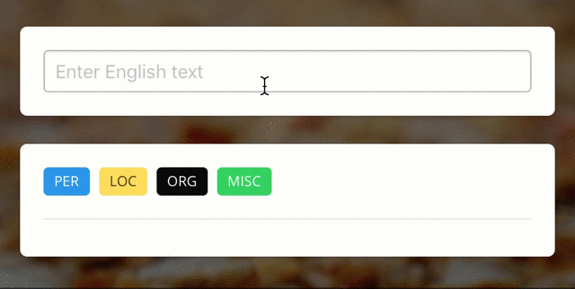

# anaGo

**anaGo** is a Python library for sequence labeling(NER, PoS Tagging,...), implemented in Keras.

anaGo can solve sequence labeling tasks such as named entity recognition (NER), part-of-speech tagging (POS tagging), semantic role labeling (SRL) and so on. Unlike traditional sequence labeling solver, anaGo don't need to define any language dependent features. Thus, we can easily use anaGo for any languages.

As an example of anaGo, the following image shows named entity recognition in English:

[anaGo Demo](https://anago.herokuapp.com/)



<!--


-->

## Get Started

In anaGo, the simplest type of model is the `Sequence` model. Sequence model includes essential methods like `fit`, `score`, `analyze` and `save`/`load`. For more complex features, you should use the anaGo modules such as `models`, `preprocessing` and so on.

Here is the data loader:

```python
>>> from anago.utils import load_data_and_labels

>>> x_train, y_train = load_data_and_labels('train.txt')
>>> x_test, y_test = load_data_and_labels('test.txt')
>>> x_train[0]
['EU', 'rejects', 'German', 'call', 'to', 'boycott', 'British', 'lamb', '.']
>>> y_train[0]
['B-ORG', 'O', 'B-MISC', 'O', 'O', 'O', 'B-MISC', 'O', 'O']
```

You can now iterate on your training data in batches:

```python
>>> import anago

>>> model = anago.Sequence()
>>> model.fit(x_train, y_train, epochs=15)
Epoch 1/15
541/541 [==============================] - 166s 307ms/step - loss: 12.9774
...
```

Evaluate your performance in one line:

```python
>>> model.score(x_test, y_test)
0.802  # f1-micro score
# For more performance, you have to use pre-trained word embeddings.
# For now, anaGo's best score is 90.94 f1-micro score.
```

Or tagging text on new data:

```python
>>> text = 'President Obama is speaking at the White House.'
>>> model.analyze(text)
{
    "words": [
        "President",
        "Obama",
        "is",
        "speaking",
        "at",
        "the",
        "White",
        "House."
    ],
    "entities": [
        {
            "beginOffset": 1,
            "endOffset": 2,
            "score": 1,
            "text": "Obama",
            "type": "PER"
        },
        {
            "beginOffset": 6,
            "endOffset": 8,
            "score": 1,
            "text": "White House.",
            "type": "LOC"
        }
    ]
}
```

To download a pre-trained model, call `download` function:

```python
>>> from anago.utils import download

>>> url = 'https://s3-ap-northeast-1.amazonaws.com/dev.tech-sketch.jp/chakki/public/conll2003_en.zip'
>>> weights, params, preprocessor = download(url)
>>> model = anago.Sequence.load(weights, params, preprocessor)
>>> model.score(x_test, y_test)
0.909446369856927
```

If you want to use ELMo for better performance(f1: 92.22), you can use [ELModel](https://github.com/Hironsan/anago/blob/master/anago/models.py#L125) and [ELMoTransformer](https://github.com/Hironsan/anago/blob/master/anago/preprocessing.py#L197):

```python
# Transforming datasets.
p = ELMoTransformer()
p.fit(x_train, y_train)

# Building a model.
model = ELModel(...)
model, loss = model.build()
model.compile(loss=loss, optimizer='adam')

# Training the model.
trainer = Trainer(model, preprocessor=p)
trainer.train(x_train, y_train, x_test, y_test)
```

For futher details, see [anago/examples/elmo_example.py](https://github.com/Hironsan/anago/blob/master/examples/elmo_example.py).

## Feature Support

anaGo supports following features:

* Model Training
* Model Evaluation
* Tagging Text
* Custom Model Support
* Downloading pre-trained model
* GPU Support
* Character feature
* CRF Support
* Custom Callback Support
* :collision:(new) ELMo

anaGo officially supports Python 3.4–3.6.

## Installation

To install anaGo, simply use `pip`:

```bash
$ pip install anago
```

or install from the repository:

```bash
$ git clone https://github.com/Hironsan/anago.git
$ cd anago
$ python setup.py install
```

## Documentation

(coming soon)

<!--
anaGo supports pre-trained word embeddings like [GloVe vectors](https://nlp.stanford.edu/projects/glove/).
-->

## Reference

This library is based on the following papers:

* Lample, Guillaume, et al. "[Neural architectures for named entity recognition.](https://arxiv.org/abs/1603.01360)" arXiv preprint arXiv:1603.01360 (2016).
* Peters, Matthew E., et al. "[Deep contextualized word representations.](https://arxiv.org/abs/1802.05365)" arXiv preprint arXiv:1802.05365 (2018).
